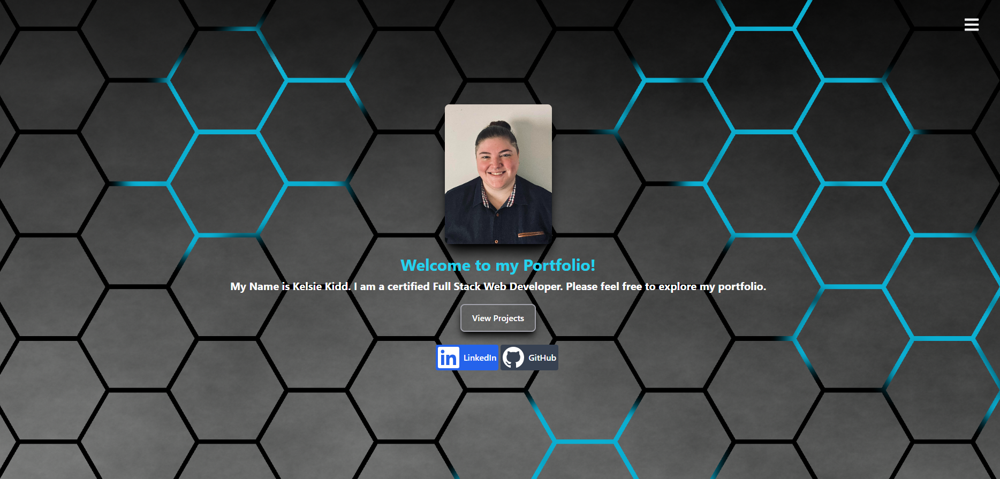
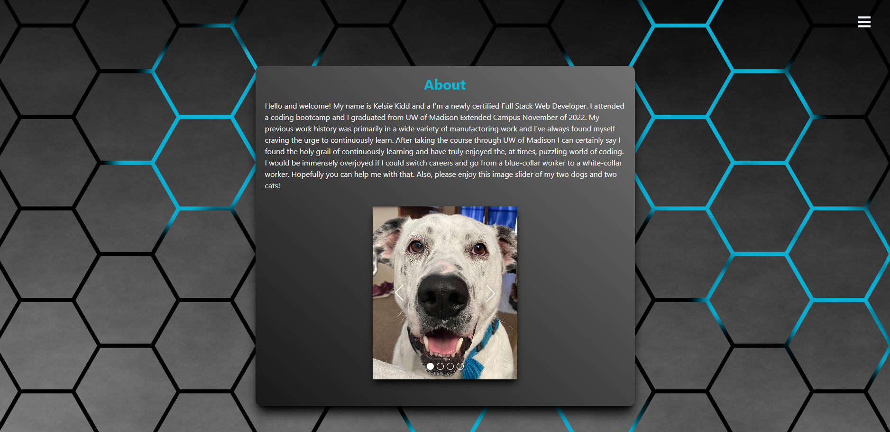

# React Portfolio

### Description
My porfolio is a React app deployed through Heroku. This portfolio was designed for easy accessability and to showcase some of the many skills I've acquired for potential emloyers.

### Installation
This porfolio was deployed through Heroku so that no installation is required to use this application.

##### For local use:
* Clone the code
* In the the terminal, making sure you're in the root directory, run npm install or npm i.
* After installation is complete run npm start. 

### Built With
* HTML
* CSS
* Tailwind CSS
* JavaScript
* Bootstrap
* React
* Heroku

